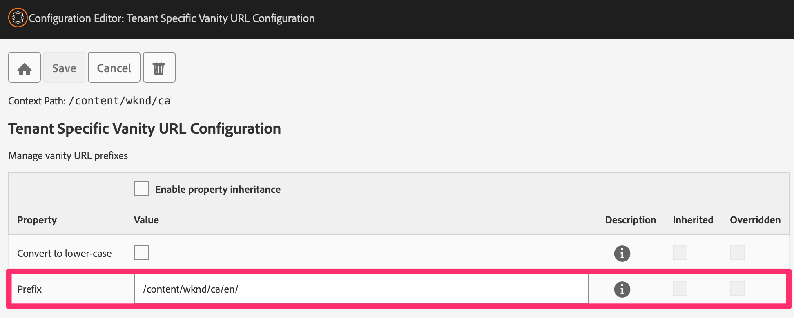

# AEM Tenant Specific Vanity URLs

This solution allows you to manage the same vanity URL for different content trees.
It circumvents the limitation of Sling where vanity URLs are global.

## Requirements

The following AEM versions are supported:
* AEM 6.5.15 and later
* AEM Cloud

## Installation

Please install the aem-tenant-specific-vanity-urls.all package on your AEM instance.
This will install the bundle and clientlib to manage tenant specific vanity URLs.
As the configuration is done via context aware configuration, please also install the wcm.io configuration editor from https://wcm.io/caconfig/editor/usage.html.

Now, you can setup the domains.

### AEM

Please put a context aware configuration in each content root folder of a domain.
E.g. in our example "/content/wknd/ca/en" serves "http://ca.vanity.local:8080". Then put it in "/content/wknd/ca/en".
Add the configuration type "Tenant Specific Vanity URL Configuration" and set a prefix.

The prefix can be any value (e.g. "/content/wknd/ca/en") but must be unique for all domains. If you use sling mappings please use the root path (serving e.g. "http://ca.vanity.local:8080/") of your content tree (e.g. "/content/wknd/ca/en"). This makes sure that the sling mapping maps the vanity URL with the right prefix.

Now, as soon as an author sets a vanity URL, this prefix will be added. This makes sure all vanity URLs have the correct prefix.

### Dispatcher

Please check that vanity URLs (e.g. "http://ca.vanity.local:8080/wow") are handled correctly by your rewrites and filter rules.
E.g. check if they are not blocked or transformed. The result needs to be "/content/wknd/ca/en/wow.html" in our example.

Vanity URLs should not have any extension. If your normal pages have an ".html" extension then make sure that
a call of e.g. "http://ca.vanity.local:8080/wow" is correctly handled by your rewrites and results in e.g. "/content/wknd/ca/en/wow.html".

## Examples

You can install our example package. This includes pre-defined configuration for AEM's [WKND](https://github.com/adobe/aem-guides-wknd) pages.
Please make sure that the [WKND](https://github.com/adobe/aem-guides-wknd) package is installed before as our example package will configure it during package installation.

There are two domains setup in the dispatcher example configuration to demonstrate the solution.
This will allow you to see different content for the same vanity URL ("wow"):

* http://us.vanity.local:8080/wow
* http://ca.vanity.local:8080/wow

Required changes to /etc/hosts:

    127.0.0.1       ca.vanity.local
    127.0.0.1       us.vanity.local

See the page properties for the vanity URL configuration:

* http://localhost:4502/editor.html/content/wknd/us/en/adventures/climbing-new-zealand.html
* http://localhost:4502/editor.html/content/wknd/ca/en/adventures/yosemite-backpacking.html

The vanity URL configuration can be found here:

* http://localhost:4502/content/wknd/us/configuration.html
* http://localhost:4502/content/wknd/ca/configuration.html

## License

The software is licensed under the [MIT license](LICENSE).

## Developers

[Developers area](docs/developers.md)